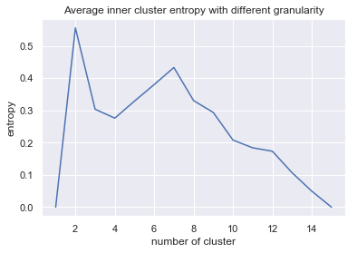

# Experiment 3
Adversarial transferability and knowledge transferability among data distributions.

## Requirements

To install requirements:

```
pip install -r taskbank/requirements.txt
```

Download sample data at [public repo](https://github.com/alexsax/taskonomy-sample-model-1)

## Pre-trained Models

You can download pretrained models here:

- [exp3](https://github.com/StanfordVL/taskonomy/tree/master/taskbank) 

or run:

```
./taskbank/tools/download_model.sh
```

## Adversarial Attack and Transfer
To perform adversarial attack and calculate per image adversarial loss, run this command:
```
python3 tools/attack_and_transfer.py --data_dir <data_path> --attack <attack-type> --eps <attack-epsilon> --source <source-model-name>
```
For example:
```
python3 tools/attack_and_transfer.py --data_dir ~/exp3/data/assets/taskonomy-sample-model-1 --attack pgd --eps 0.03 --source autoencoder
```
> Transfer the adversarial examples generated on Autoencoder to other tasks in the pool and record per image loss results.

> To replicate experiment 3 in the paper, run commands in taskbank/cmd.sh

## Visualization
```
python3 visualize.py
```
> Code to generate graphs in result

## Results



## Acknowledgement
This code is adapted from [public repo](https://github.com/StanfordVL/taskonomy)
